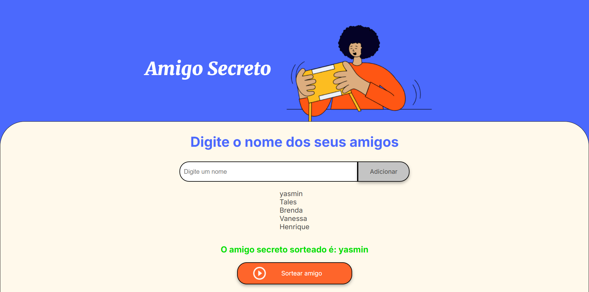

# Amigo Secreto

Este é um aplicativo simples de "Amigo Secreto", desenvolvido como parte de um **desafio proposto pela Alura**, no programa **Iniciantes da Programação G8- ONE**. O objetivo do desafio é ensinar os conceitos básicos de JavaScript, criando uma aplicação simples e interativa  **HTML**, **CSS** e **JavaScript**. O sistema permite aos usuários adicionar nomes à lista de amigos e realizar o sorteio de maneira aleatória para descobrir quem será o amigo secreto de cada pessoa.

  

                                                                               
## Funcionalidades

- **Adicionar amigos**: Insira o nome dos amigos na lista.
- **Sortear amigo secreto**: Após adicionar pelo menos dois amigos, você pode realizar o sorteio e ver quem foi sorteado para ser o amigo secreto de cada um.
- **Validação de entrada**: O sistema valida se o campo de nome está vazio antes de adicionar o nome à lista, evitando entradas vazias.

